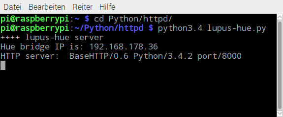

# lupus-hue

## Steuere Philips Hue Lichter über die LUPUS XT2+ Alarmanlage!

Die LUPUS XT2+ Alarmanlage bietet eine Reihe von Home Automation Regeln, um verschiedene Aspekte eines intelligenten Heims
zu steuern. Unter anderem ist es möglich Lichter oder andere Verbraucher über die Unterputzrelais oder die Funksteckdosen zu schalten.

Das ist eine schöne Möglichkeit für die Simulation einer Anwesenheit durch Lichter wenn die Anlage scharf gestellt wird. 
Wer jedoch bereits intelligente LED-Lichter von Philips im Einsatz hat oder mit den von LUPUS gebotenen Möglichkeiten der Lichtsteuerung nicht weiterkommt, für den bietet sich mit diesem Projekt die Hue- und kompatible Lampen von der LUPUS XT-ANlage aus zu steuern.

## Voraussetzungen

Folgendes Equipment wird vorausgesetzt:
+ LUPUS XT2+ (getestet mit FW 0.0.2.17)
+ Rapsberry Pi 3 (mit aktuellem Rasbian basierend auf Jessie)
+ Philips Hue Bridge (getestet mit Bridge v2, sollte aber auch mit v1 laufen)
+ Philips Hue oder kompatible Leuchtmittel (z.B. auch Osram Lightify oder innr)

Optional:
+ LUPUS Lichtsensor (für lichtabhängige Steuerung)
+ LUPUS Bewegungsmelder (für bewegungsabhängige Steuerung)
+ OSRAM Lightify Plug (günstige Funksteckdose)
+ Andere Sensoren wie sie in den Home Automation Regeln genutzt werden 

## Features & Anwendungsfälle

lupus-hue hat folgende Features:
+ Räume (Groups) oder Lichter ein- und ausschalten
+ Setzen von Helligkeit, Farben oder Lichttemperatur für Räume (Groups) oder einzelne Lichter
+ Erstellen und Aufrufen von Szenen (verschiedene Einstellungen für die Lichter eines Raums)
+ Setzen von Timern für das Ein- und Ausschalten (entspricht der "Einschalten für" von LUPUS aber auch mit "Ausschalten für")
+ Loops für Effekte (z.B. für die Signalisierung eines Zustands oder bei Alarm)

Typische Anwendungsfälle:
+ Lichter bei Dämmerung einschalten wenn Anlage scharf
+ Lichter abends automatisch ausschalten oder Nachtlichtmodus aktivieren (Dimmung)
+ Verschiedene Lichtemperaturen für verschiedene Tageszeiten setzen
+ Lichter ausschalten, wenn es außen hell genuug ist (immer oder nur in einem bestimmten Zustand der Anlage)
+ Lichter für eine definierte Zeit einschalten bei Bewegung (gemeldet über einen LUPUS Bewegungsmelder)
+ Lichter einschalten oder blinken lassen, wenn Alarm ausgelöst wird
+ Scharfschaltungszustand der Anlage bei Betreten des Hauses über Farbe eines Lichtes signalisieren 

## Installation & Setup

### 1. Programm auf Raspberry Pi kopieren

Die Dateien lupus-hue.py und lupus-hue.conf müssen in ein beliebiges Verzeichnis auf dem Raspberry Pi kopiert werden.
Der Webservice, der die Ligithubchtsteuerung übernimmt muss mit dem python Interpreter in Version 3.4 aufgerufen werden:

In der Literatur zum Raspberry Pi werden verschiedene Methoden vorgestellt, wie ein solches Kommando automatisch beim Start
des Raspberry Pi ausgeführt werden kann.

Zuvor muss aber noch die lupus-hue.conf Datei editiert werden.

Folgender Eintrag muss vorgenommen werden:

+ hue-ip-adress: IP Adresse der Philips Hue Bridge

Alle weiteren Einträge werden erst für weitergehende Einstellungen benätigt und können zunächst ignoriert werden.

### 2. Action-URL auf der LUPUS XT2+ konfigurieren

Der lupus-hue Webservice auf dem Raspberry Pi wird über einen HTTP Get-Request aufgerufen:

http://ip_des_raspi:8000/kommando?param1=wert1_param2=wert2

Für ip_des_raspi ist die reale IP-Adresse des Raspberry Pi einzusetzen (also z.B. 192.168.0.111). Der Router im Heimnetz
muss so konfiguriert sein, dass dem Raspberry Pi immer dieselbe IP-Adresse zugewiesen wird.

Der erste Teil dieses HTTP-Requests ist als Parameter in der Weboberfläche der LUPUS Anlage zu hinterlegen. 
In der Admin-Oberfläche zu Netzwerk -> Kameras und dort eintragen: http://ip_des_raspi:8000/ 

xxx Bild einfügen

Dieser String wird später in den Home Automation Regeln über den Parameter $1 eingefügt.

### 3. Home Automation Regeln für Lichtsensor einrichten

Wenn der Lichtsensor nicht benutzt wird, kann dieser Abschnitt übersprungen werden.

Es müssen die folgenden Home Automation Regeln in der XT2 angelegt werden:

xxx Bild einfügen

+ Wenn Lux zwischen 0 und 5 -> Immer -> Action-URL "$1/lux?x=5
+ Wenn Lux zwischen 6 und 6 -> Immer -> Action-URL "$1/lux?x=6
+ Wenn Lux zwischen 7 und 7 -> Immer -> Action-URL "$1/lux?x=7
+ Wenn Lux zwischen 8 und 8 -> Immer -> Action-URL "$1/lux?x=8
+ Wenn Lux zwischen 9 und 16 -> Immer -> Action-URL "$1/lux?x=9

xxx Bild einfügen

In meinen Tests haben sich die Lux-Level von 5 ... 9 als in der Praxis relevant erwiesen. Sollten doch mehr Stufen benötigt werden
müssen entsprechende Regeln ergänzt werden. Das Programm lupus-hue kann mit allen Werten zwischen 0 und 16 zurecht kommen.

Zum Start des lupus-heu Webservice wird der Lux-Wert intern auf 0 gesetzt bis zum ersten Mal eine Home Automation Regel des
Lichtsensors auslöst und damit der richtige Wert gesetzt wird. Alternativ kann über einen Browser der Lux-Wert auch zum Testen oder
initial manuell gesetzt werden (siehe weiter unten: Kommando "lux").

### 4. Philips Hue

Ich habe dieses Programm ausschließlich mit der Standard Hue App von Philips getestet. Grundsätzlich müsste lupus-hue aber auch
mit Apps von Dritten zusammen arbeiten.

Es sollten alle Räume - in der Philips Hue API heißen diese Gruppen bzw. Groups - und Lichter über die App eingerichtet werden. Wenn
hier von Gruppe die Rede ist, kann synonym auch Raum benutzt werden.

Über lupus-hue können die Farbwerte nach dem Hue/Sat-Schema und Weißtöne nach der Farbtemperatur (color temperatur) eingestellt werden.

Siehe dazu: https://www.developers.meethue.com/documentation/core-concepts

Für die Nutzung von Szenen siehe Kapitel "Szenen".

## Das Web-API

Hier wird zunächst das Web-API des lupus-hue Webservice erläutert, bevor weiter unten die praktischen Beispiele in Verbindung mit der
LUPUS Anlage erklärt werden.

Im Folgenden werden die verschiedenen Kommandos für den Webservice erklärt:

### Kommando "info" - Informationen zu Lichtern oder Gruppen (Räumen) ausgeben

#### http://ip_des_raspi:8000/info?g=group

Gib Informationen zu Gruppe (Raum) group aus.

#### http://ip_des_raspi:8000/info?g=group

Gib Informationen zu Licht light aus. light ist die Nummer des Lichtes. Die Nummern der Lichter eines Raumes kann mit 
info?g=group ermittelt werden.

### Kommando "on" - Einschalten eines Lichtes oder einer Gruppe

#### http://ip_des_raspi:8000/on?g=group[_t=seconds][_d=1_x=lux][_b=bri]

Schalte die Gruppe (Raum) group ein und setze ggf. einen Timer bzw. verzögere die Einschaltung.

+ _t=seconds  Setze einen Timer von seconds Sekunden, nach denen das Licht / die Gruppe wieder ausgeschaltet wird.
+ _d=1_l=lux  Wenn angegeben, wird das Einschalten verzögert, bis der Lux-Level lux oder niedriger erreicht wird.
+ _b=bri      Setze die Helligkeit auf bri (0 .. 254)

Beispiele:

+ http://192.168.0.111:8000/on?g=Flur_b=200_t=180

Schaltet die Lichter im Raum "Flur" für 180 Sekunden ein und setzt die Helligkeit auf 200 (von 254).

+ http://192.168.0.111:8000/on?g=all_d=1_x=6

Schalte alle Lichter ein, sobald der Lux Level am Lichtsensor auf 6 gesunken ist.

#### http://ip_des_raspi:8000/on?l=light[_t=seconds][_d=1_x=lux]

Wie oben aber für das Licht light.

#### http://ip_des_raspi:8000/on?g=group_h=hue_s=sat[_b=bri][_t=seconds][_d=1_x=lux]

Schalte die Gruppe (Raum) group ein und setze Farbe und Farbsättigung.

+ _h=hue      Setze den "hue" Wert des Lichts / des Raums auf hue (siehe Kapitel "Farben"). 
+ _s=sat      Setze die Sättigung aus sat.
+ Andere Parameter wie oben

#### http://ip_des_raspi:8000/on?l=light_h=hue_s=sat[_b=bri][_t=seconds][_d=1_x=lux]

Wie oben aber für das Licht light.

Beispiel:

+ http://192.168.0.111:8000/on?l=10_h=21986_s=253

Schaltet das Licht 10 ein und setzt einen tiefgrünen Farbton.

#### http://ip_des_raspi:8000/on?g=group_c=coltemp[_b=brightness][_t=seconds][_d=1_x=lux]

Schalte die Lichter der Gruppe (Raums) group ein und setze die Farbtemperatur auf coltemp. Andere Parameter wir oben. Siehe auch Kapitel "Farben".

#### http://ip_des_raspi:8000/on?l_light_c=coltemp[_b=brightness][_t=seconds][_d=1_x=lux]

Schalte das Licht light ein und setze die Farbtemperatur auf coltemp. Andere Parameter wir oben.

#### http://ip_des_raspi:8000/on?g=group_n=scene[_t=timer][_d=deferred_x=lux_level]

Aktiviere die Szene scene für Gruppe (Raum) group. Andere Parameter wie oben.

Zu Szenen siehe auch unten stehendes Kapitel "Szenen".

### Kommando "off" - Schalte Licht oder Raum aus

#### http://ip_des_raspi:8000/off?g=group[_t=timer]

Schalte Raum (Gruppe) group aus.

+ _t=seconds  Setze einen Timer von seconds Sekunden, nach denen die Gruppe wieder eingeschaltet(!) wird.

#### http://ip_des_raspi:8000/off?l=light[_t=timer]

Schalte Licht light aus.

### Kommando "lux" - Setze Lichtwert aus LUPUS Alarmanlage

#### http://ip_des_raspi:8000/lux?x=level

Setzte den Lux-Level gemäß dem aktuellen Stand. Siehe auch oben zu den in jedem Fall zu definierenden Home Automation Regeln.

### Kommando "loop" - Erzeuge eine Loop

#### http://ip_des_raspi:8000/loop?g=group_n=scene_t=seconds

Mit Hilfe einer Loop können verschiedene Lichter für einen definierten Zeitraum blinken und dann in einen Endzustand übergehen. 
Es werden nur die Lichter verändert, die sowohl in Gruppe group als auch in Szene scene enthalten sind. scene steht als
Platzhalter für die Szenen scene1, scene2 und scene3. Während der Loop wird zwischen den Szenen scene1 und scene2 im Sekundentakt
gewechselt (geblinkt). Nach Beendigung der Loop wird die Szene scene3 aktiviert.

Siehe auch das  Kapitel "Szenen".

## Einfache Anwendungen

###  Schalten des Lichtes zu einer Zeit und abhängig vom Scharf-Zustand 

Eine wichtige und sinnvolle Anwendung ist das Einschalten von Lichtern im Modus "arm". Hierzu kann folgende einfache Home Automation
Regel in der LUPUS Anage dienen:

xxx

Wenn Area1 und Modus-Wechsel "arm" -> Zeit 17:00 bis 17:00 -> Action-URL $1/on?g=Wohnzimmer_b=180

Schaltet immer um 17:00 wenn die Anlage in Area1 scharf ist im Wohnzimmer die Lichter ein und dimmt die Helligkeit auf 180 (von 254.

###  Schalten des Lichtes abhängig von der Helligkeit 

Wird der Lichtsensor eingesetzt, kann die Steuerung des Lichtes abhängig von der Meldung des Sensors erfolgen:

xxx

Wenn Area1 und Modus-Wechsel "disarm" -> Zeit 7:00 bis 7:00 -> Action-URL $1/on?g=Kueche_x=7

Schaltet immer morgens um 7:00 das Licht in der Küche ein, aber nur wenn die Anlage unscharf ist (Modus disarm) und wenn
die Helligkeit nicht größer als 7 ist. D.h. sollte um 7:00 der Sensor Lux 8 oder höher gemeldet haben, wird das Licht nicht
geschaltet.

###  Verzögertes Schalten zur Dämmerung

Einer der größten Einschränkungen in der jetzigen Version der LUPUS XT ist die unzureichende Möglichkeit, die Helligkeit und
den Modus (Scharf-Zustand) der Anlage vernünftig zu kombinieren:

- Die Helligkeit 

Dazu gibt es das verzögerte Schalten abhängig von der Helligkeit. 

Beispiel:

xxx

Wenn Area1 und Modus-Wechsel "disarm" -> Zeit 7:00 bis 7:00 -> Action-URL $1/on?g=Kueche_x=7

Schaltet immer morgens um 7:00 das Licht in der Küche ein, aber nur wenn die Anlage unscharf ist (Modus disarm) und wenn
die Helligkeit nicht größer als 7 ist. D.h. sollte um 7:00 der Sensor Lux 8 oder höher gemeldet haben, wird das Licht nicht
geschaltet.

## Fortgeschrittene Konzepte

### Timer 

### Verzögertes Schalten bei Licht-Level

Durch
### Szenen und Loops

### Meta-Räume

An jeder Stelle an der in der obigen API-Beschreibung die Nennung eines Raumes möglich ist, der in der Hue Bridge angelegt sein muss,
kann auch ein "Meta-Raum" angegeben werden. Das sind Listen von Räumen, die in der Konfigurationsdatei lupus-hue.conf hinterlegt werden
können.

Meta-Räume dienen der Reduktion der nötigen Home Automation Regeln in der LUPUS XT-Anlage. Beispiel:

In der Hue Bridge wurden die Räume "Wohnzimmer", "Flur" und "Kueche" angelegt. Es wird nun der Meta-Raum "Erdgeschoss" angelegt, der 
als "Wohnzimmer" + "Flur" + "Kueche" definiert wird.

Nun kann in jedem Kommando "Erdgeschoss" als Gruppe bzw. Raumname genutzt werden und damit die Steuerung aller Lichter in den
drei eigentlichen Räumen gesteuert werden. 

Der Raum "all" steht für alle Lichter, die in der Bridge angelegt sind. "all" wird auf die vordefinierte Hue Gruppe "0" abgebildet.

Die Konfiguration für Meta-Räume in der lupus-hue.conf sieht wie folgt aus:

xxx 

## Quellen
